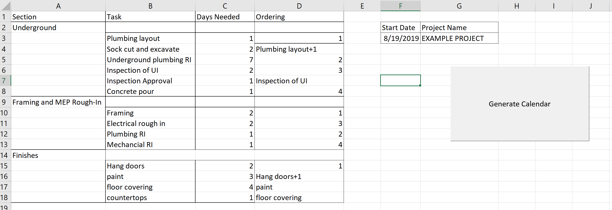
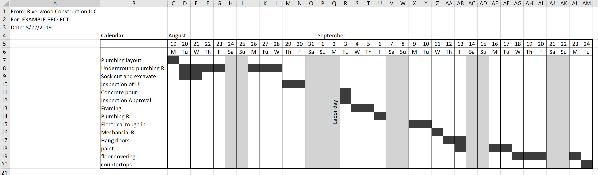

# Construction Project Scheduler
##### Programmer: Gavin Macpherson
A program to generate project schedules for Riverwood Construction. Input and output uses Excel spreadsheets for nontechnical users.

 

#### Input Data
User enters the tasks needed for a specific job, the days needed to complete that task, and its order. The user will then click the "Generate Calendar" button, and a new worksheet with the project calendar will be generated.

 Ordering can be entered either numerically (execute task "1", then "2", etc) or sequentially. Sequential execution indicates when a task should start in relation to a prior task. For example, cell D17 indicates that task "floor covering" will execute upon the completion of task "paint". The user is also able to start a task before an earlier task has completed; an example of this is in cell D4, which indicates task "Sock cut and excavate" should execute one day after task "Plumbing layout" begins.

This data is then to generate a calendar using macros coded in Visual Basic.

 

#### Output Calendar
A calendar is created in a new worksheet as shown in the photo below. The days a task is being executed are filled in dark grey, while weekends and holidays observed by the company are in light grey.

Note: this calendar is exactly what was generated by the Visual Basic code, and has not undergone any additional cosmetic changes.

